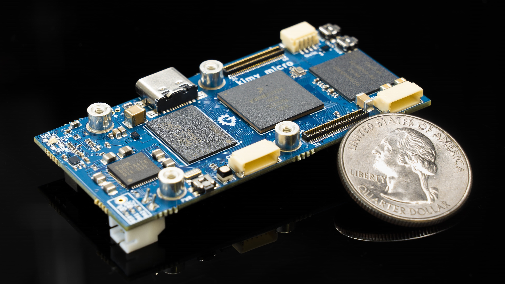

The kimχ micro is an open hardware single board computer for the NXP i.MX8M Mini Application
processor.

## About

kimχ micro is a compact single board computer that offers great versatility for many different applications. It is about the size of a Raspberry Pi Zero, but packs a more powerful processor and more expansion and connectivity possibilities.

## Features

### Application Processor

The i.MX8M Mini supports 1080p60 hardware video encode/decode, and is available in a few different configurations from single to quad core with an efficient LPDRR4 memory interface.

### Mini PCIe

The board can host a half- or full-mini PCIe module as often used for high-power wifi chipsets. Mini PCIe is also perfect for other types of wireless such as LTE and LoRa radios.

### USB-C and Power

A full-featured USB-C port with power source and sink capabilities supports power to the board as well as circuitry for lithium ion battery charging. An independent battery gauge IC monitors battery charge and discharge so software can assess battery level, regardless of the state of the application processor.

### Expansion

To enable different applications, kimχ micro has high-density expansion connectors and a standard add-on module specification, as well as a Qwiic connector for rapid prototyping or simple sensor integration.
